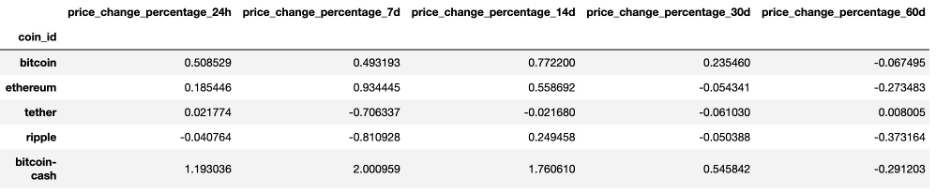
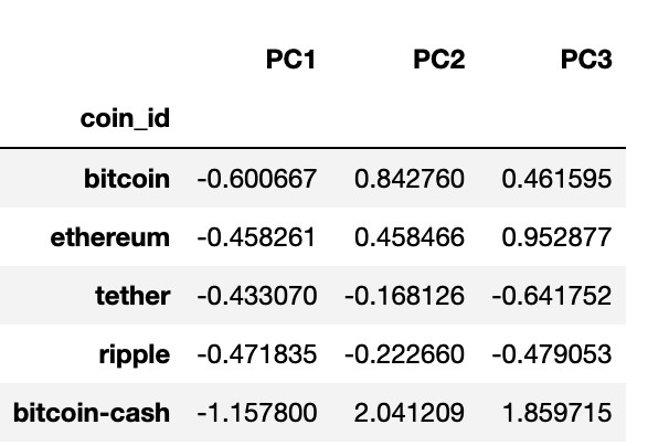

# CryptoClustering

In this challenge, you’ll use your knowledge of Python and unsupervised learning to predict if cryptocurrencies are affected by 24-hour or 7-day price changes. 
## Before You Begin
Create a new repository for this project called CryptoClustering. Do not add this homework to an existing repository.  
Clone the new repository to your computer.  
Push your changes to GitHub. 
## Files
Download the following files to help you get started:  
Module 19 Challenge files Links to an external site. 
## Instructions
Rename the Crypto_Clustering_starter_code.ipynb file as Crypto_Clustering.ipynb.  
Load the crypto_market_data.csv into a DataFrame.  
Get the summary statistics and plot the data to see what the data looks like before proceeding. 
## Prepare the Data
Use the StandardScaler() module from scikit-learn to normalize the data from the CSV file.  
Create a DataFrame with the scaled data and set the "coin_id" index from the original DataFrame as the index for the new DataFrame.  
The first five rows of the scaled DataFrame should appear as follows: 

## Find the Best Value for k Using the Original Scaled DataFrame
Use the elbow method to find the best value for k using the following steps:  
Create a list with the number of k values from 1 to 11.  
Create an empty list to store the inertia values.  
Create a for loop to compute the inertia with each possible value of k.  
Create a dictionary with the data to plot the elbow curve.  
Plot a line chart with all the inertia values computed with the different values of k to visually identify the optimal value for k.  
Answer the following question in your notebook: What is the best value for k? 
## Cluster Cryptocurrencies with K-means Using the Original Scaled Data
Use the following steps to cluster the cryptocurrencies for the best value for k on the original scaled data:  
Initialize the K-means model with the best value for k.  
Fit the K-means model using the original scaled DataFrame.  
Predict the clusters to group the cryptocurrencies using the original scaled DataFrame.  
Create a copy of the original data and add a new column with the predicted clusters.  
Create a scatter plot using hvPlot as follows:  
Set the x-axis as "price_change_percentage_24h" and the y-axis as "price_change_percentage_7d".  
Color the graph points with the labels found using K-means.  
Add the "coin_id" column in the hover_cols parameter to identify the cryptocurrency represented by each data point. 
## Optimize Clusters with Principal Component Analysis
Using the original scaled DataFrame, perform a PCA and reduce the features to three principal components.  
Retrieve the explained variance to determine how much information can be attributed to each principal component and then answer the following question in your notebook:  
What is the total explained variance of the three principal components?  
Create a new DataFrame with the PCA data and set the "coin_id" index from the original DataFrame as the index for the new DataFrame.  
The first five rows of the PCA DataFrame should appear as follows: 

## Find the Best Value for k Using the PCA Data
Use the elbow method on the PCA data to find the best value for k using the following steps:  
Create a list with the number of k-values from 1 to 11.  
Create an empty list to store the inertia values.  
Create a for loop to compute the inertia with each possible value of k.  
Create a dictionary with the data to plot the Elbow curve.  
Plot a line chart with all the inertia values computed with the different values of k to visually identify the optimal value for k.  
Answer the following question in your notebook:  
What is the best value for k when using the PCA data?  
Does it differ from the best k value found using the original data? 
## Cluster Cryptocurrencies with K-means Using the PCA Data
Use the following steps to cluster the cryptocurrencies for the best value for k on the PCA data:  
Initialize the K-means model with the best value for k.  
Fit the K-means model using the PCA data.  
Predict the clusters to group the cryptocurrencies using the PCA data.  
Create a copy of the DataFrame with the PCA data and add a new column to store the predicted clusters.  
Create a scatter plot using hvPlot as follows:  
Set the x-axis as "PC1" and the y-axis as "PC2".  
Color the graph points with the labels found using K-means.  
Add the "coin_id" column in the hover_cols parameter to identify the cryptocurrency represented by each data point.  
Answer the following question:  
What is the impact of using fewer features to cluster the data using K-Means? 
### REWIND 
Recall that you learned how to create composite plots in a previous module. If you need a refresher on how to create these plots, review that module. You can also check Composing Plots in the hvPlot documentation. 
## Requirements
#### Find the Best Value for k by Using the Original Data (15 points) 
To receive all points, you must:  
Code the elbow method algorithm to find the best value for k. Use a range from 1 to 11. (5 points)  
To visually identify the optimal value for k, plot a line chart of all the inertia values computed with the different values of k. (5 points)  
Answer the following question: What’s the best value for k? (5 points) 
#### Cluster the Cryptocurrencies with K-Means by Using the Original Data (10 points) 
To receive all points, you must:  
Initialize the K-means model with four clusters by using the best value for k. (1 point)  
Fit the K-means model by using the original data. (1 point)  
Predict the clusters for grouping the cryptocurrencies by using the original data. Review the resulting array of cluster values. (3 points)  
Create a copy of the original data, and then add a new column of the predicted clusters. (1 point)  
Using hvPlot, create a scatter plot by setting x="price_change_percentage_24h" and y="price_change_percentage_7d". Color the graph points with the labels that you found by using K-means. Then add the crypto name to the hover_cols parameter to identify the cryptocurrency that each data point represents. (4 points) 
#### Optimize the Clusters with Principal Component Analysis (10 points) 
To receive all points, you must:  
Create a PCA model instance, and set n_components=3. (1 point)  
Use the PCA model to reduce the features to three principal components. Then review the first five rows of the DataFrame. (2 points)  
Get the explained variance to determine how much information can be attributed to each principal component. (2 points)  
Answer the following question: What’s the total explained variance of the three principal components? (3 points)  
Create a new DataFrame with the PCA data. Be sure to set the coin_id index from the original DataFrame as the index for the new DataFrame. Review the resulting DataFrame. (2 points) 
#### Find the Best Value for k by Using the PCA Data (10 points) 
To receive all points, you must:  
Code the elbow method algorithm, and use the PCA data to find the best value for k. Use a range from 1 to 11. (2 points)  
To visually identify the optimal value for k, plot a line chart of all the inertia values computed with the different values of k. (5 points)  
Answer the following questions: What’s the best value for k when using the PCA data? Does it differ from the best value for k that you found by using the original data? (3 points) 
#### Cluster the Cryptocurrencies with K-means by Using the PCA Data (10 points) 
To receive all points, you must:  
Initialize the K-means model with four clusters by using the best value for k. (1 point)  
Fit the K-means model by using the PCA data. (1 point)  
Predict the clusters for grouping the cryptocurrencies by using the PCA data. Review the resulting array of cluster values. (3 points)  
Create a copy of the DataFrame with the PCA data, and then add a new column to store the predicted clusters. (1 point)  
Using hvPlot, create a scatter plot by setting x="PC1" and y="PC2". Color the graph points with the labels that you found by using K-means. Then add the crypto name to the hover_cols parameter to identify the cryptocurrency that each data point represents. (4 points) 
#### Visualize and Compare the Results (15 points) 
To receive all points, you must:  
Create a composite plot by using hvPlot and the plus sign (+) operator to compare the elbow curve that you created from the original data with the one that you created from the PCA data. (5 points)  
Create a composite plot by using hvPlot and the plus (+) operator to compare the cryptocurrency clusters that resulted from using the original data with those that resulted from the PCA data. (5 points)  
Answer the following question: Based on visually analyzing the cluster analysis results, what’s the impact of using fewer features to cluster the data by using K-means? (5 points) 
#### Coding Conventions and Formatting (10 points) 
To receive all points, you must:  
Place imports at the top of the file, just after any module comments and docstrings, and before module globals and constants. (3 points)  
Name functions and variables with lowercase characters, with words separated by underscores. (2 points)  
Follow DRY (Don't Repeat Yourself) principles, creating maintainable and reusable code. (3 points)  
Use concise logic and creative engineering where possible. (2 points) 
#### Deployment and Submission (10 points) 
To receive all points, you must:  
Submit a link to a GitHub repository that’s cloned to your local machine and that contains your files. (4 points)  
Use the command line to add your files to the repository. (3 points)  
Include appropriate commit messages in your files. (3 points) 
#### Code Comments (10 points) 
To receive all points, your code must:  
Be well commented with concise, relevant notes that other developers can understand. (10 points) 
